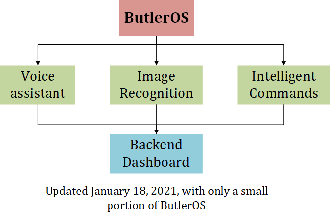

## Welcome to ButlerOS

`ButlerOS` wants to refer to existing technologies to build a `SMART HOME` environment.

## Functions

* Voice Assistant
* Image Recognition
* Intelligent commands
* Backend dashboard

## Methods

ButloerOS does not aim to write the **underlying code**, it focuses on building smart home environments using some existing proven code. How to unify these functions together to achieve a smart, efficient home environment is the main purpose of `ButlerOS`.

## Architecture

## Milestone

> Click ⚙ to switch to full screen

<iframe allowfullscreen src='https://timelines.gitkraken.com/timeline/e28b84a8b92646808c932e9d335d4f09?showControlPanel=true&showMinimap=true' style='width:100%;height:100%;border:none;' />
